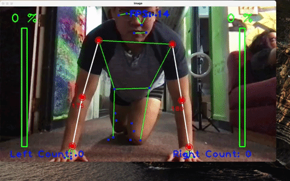

# AI Trainer 

AI Trainger is a  system  that  can give instant feedback on the form and the number of of push-ups done by an individual. The system is heavily based on BlazePose and it’s ability to be accurate yet incrediblylightweight.  The system is able to maintain not only realtime feedback, but even the percentage of the range that theuser has gone through in their rep range. This system is built to handle regular push-ups as well as single arm push-ups.

## Main Techonologies 

OpenCV, Numpy, PoseModule

## Demos

